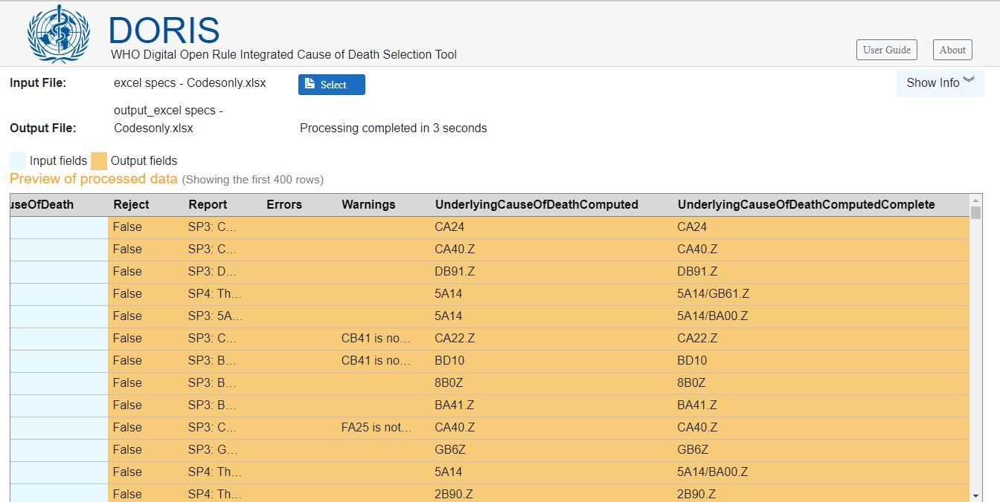

# DORIS Desktop Version for batch processing 

DORIS Desktop Version is a desktop software that can be installed on local computers. It is designed to allow effortless batch processing of large volumes of death certificates. Whether working with text or code modes, this software analyzes thousands of death certificates and supports multiple formats, Excel, CSV, and JSON.

## Download and quick installation

The DORIS UI desktop software for batch processing can be downloaded from the following link:

- Version 1.0 Release Candidate 1 
	- Download link for Windows: [DorisUI_1.0.0-rc.1_windows_x64.msix](https://icdcdn.who.int/doris/DorisUI_1.0.0-rc.1_windows_x64.msix)

DORIS installation and launch is a quick and very simple process and involves double-clicking on the downloaded file and following the on-screen instructions. 

## Supported modes and file formats

In order to use the DORIS tool effectively, users are required to provide an input file that includes the death certificates they want to process and analyze. The tool will examine the available information and following the ICD mortality rulebase which operates in the background the tool will automatically determine the underlying cause of death. 

By ensuring that the input file adheres to the required format, the tool can accurately analyze and process the information from the death certificates, providing users with an automatic selection of the underlying cause of death.

### Supported input files are text and code mode.

The DORIS tool can handle two distinct input modes: text and ICD-11 code. 

This versatility allows users to choose between entering the cause of death information in a text format or utilizing ICD-11 pre-coded data sets for efficient processing. By accommodating both input modes, the tool caters to different user preferences and data availability in countries.

     

### Supported file formats are Excel, CSV, and JSON.

By supporting multiple file formats Excel, CSV, and JSON, DORIS tool ensures compatibility and ease of use for users working with different data sources. 

**Excel files** are widely used for data management and analysis, while **CSV** (Comma-Separated Values) and **JSON** (JavaScript Object Notation) formats offer flexibility in exchanging and storing structured data. DORIS's compatibility with these formats enables users to import and analyze death certificates without the need for extensive data conversion or manipulation.

    

Users should prepare their data sets following the below templates. These template are specifically designed to ensure compatibility and proper data input in the DORIS tool. By clicking on the needed file format below, users can easily download the template and utilize it as a guideline for preparing their input file, ensuring that it meets the required format and structure. 

### Tabular formats
The detailed structure of the tabular format (Excel or CSV) could be found here:
[Excel and CSV Format specification](csv-excel-format.md)
#### Excel format    
> For a sample in Excel file click here: [Excel Format Specifications](sample.xlsx)

#### CSV format 
> For a sample in Excel file click here: [CSV Format Specifications](sample.csv)

### JSON format
> The JSON format is based on the standard [Death Certificate Exchange Format](json-format.md) 

## 5 simple steps for loading and processing the file 

1. Download the required death certificate format.

2. Open the downloaded file and accurately fill in the information (Refer to the Attributes for Input File section), making sure not to modify the format or change the column order. Preserve the original structure of the file.

3. Launch the DORIS tool.

4. Locate the **select key** to load the file for processing. Choose the file that has been filled in with the cause of death information. Even if thousands of death certificates are loaded, the tool will display the top 400 certificates for a final review, ensuring that all fields are appropriately filled before proceeding with the processing.

5. After selecting the file, click on the **process key** to initiate the file processing. Once the tool completes the task, the processing time will be displayed on the screen, along with a preview of the output file in parallel the output files will be automatically saved in the same location as the input file.

The DORIS tool provides two output formats to enhance the user experience:
   - The first output includes the selected underlying cause of death, the steps followed, and any relevant flags or warnings. This provides users with valuable information about the cause of death selection process.
   - The second output is specifically designed to be compatible with the ANACoD-3 tool. Users can effortlessly load this output directly into the ANACoD-3 tool for further processing. This eliminates the need to create a new input file that adheres to ANACoD-3 compatibility requirements. 

By following these steps, users can effectively utilize the DORIS Desktop Version to run and process death certificate files, ensuring that the cause of death information is accurately captured and maintained and allowing users to benefit from an end-to-end solution using ICD-11 suite of tools.

## Attributes for Input file

When entering input data, there are specific attributes related to the input fields that should be considered.

A more detailed explanation of the Input file can be found in the [Excel and CSV Format specification](csv-excel-format.md) and [JSON Death Certificate Exchange Format](json-format.md) Below is a summary of the fields:

- **CertificateKey**: This attribute serves as a unique identifier for the certificate. Users need to define a CertificateKey to identify a particular certificate.

- **(ICD) version**: Users must specify the version of the  International Classification of Diseases (ICD) that was used to code the certificate. The current supported version is ICD-11.

- **Sex**: This attribute denotes the sex of the individual. The value "1" corresponds to Male, "2" corresponds to Female, and "9" corresponds to Unknown. Please note that while the tool accepts "M" for Male and "F" for Female at the input stage, it will automatically convert them to "1" and "2" respectively to align with the required ANACOD-3 output for subsequent stages of data management and visulatization.

- **Date of birth and date of death**: Users should adhere to the specified date format when entering the dates of birth and death.

- **Estimated age** When providing an estimated age for an individual, this attribute should be represented in the specified duration format. If only numbers are filled in the column, the tool will assume that the age is provided in years. 

- **Cause of Death**: This attribute can be completed in Part 1 and Part 2 using any of the following methods:

	1. **Textual description**: Users have the option to provide a plain text description of the cause of death. In this case, they should fill in the corresponding columns in the input file, 	such as CauseOfDeathTextA, CauseOfDeathTextB, CauseOfDeathTextPart2, and so on.

	2. **ICD-11 codes**: Users can enter ICD-11 codes separated by commas. They should fill in the corresponding columns in the input file, such as CauseOfDeathA, CauseOfDeathB, 			CauseOfDeathPart2, and so forth. Post-coordination is allowed, meaning that different codes can be combined, for example, "Stem code A & Ext code / Stem code B".

	3. **URIs**: For ICD-11, users have the option to provide URIs (Uniform Resource Identifiers) for cause fields, separated by commas. They should fill in the corresponding columns in the input file, such as CauseOfDeathURIA, CauseOfDeathURIB, CauseOfDeathURIPart2, and so on. Post-coordination is allowed.

- **Interval**: Users can specify the time interval from the onset of the condition leading to death to the actual time of death. The interval should be represented in the specified duration format.

## Additional Attributes of the Output file

The output file generated by the DORIS tool includes various fields with specific attributes that provide valuable information for user guidance. Here is a detailed explanation of each field:

**Reject column**: This field indicates whether a certificate has been accepted or rejected. Results will be marked as 'True' or 'False'.
- An entry marked as 'False' means the certificate was accepted and the underlying cause of death was provided.
- An entry is marked as 'True' indicates rejection and the certificate has been flagged for manual review. Rejection can occur due to various reasons, such as ICD-11 codes not being found in the linearization, typographical errors, implausible coding, system errors, and more.

**Report column**: This field provides an overview of the steps applied by the rule engine to select the underlying cause of death. It offers insights into the processes and mortality rules employed in determining the cause of death based on the available information.

**Errors column**: This field captures any errors encountered during the certificate processing. Errors may arise due to invalid input, formatting issues, or other inconsistencies that need to be addressed. 

**Warnings column**: This field logs any warnings generated during processing. Warnings serve as alerts for potential anomalies that might not necessarily lead to rejection but should be reviewed and taken into consideration. Addressing these warnings can help improve the overall quality and reliability of the underlying cause of death selection.

**UnderlyingCauseOfDeathComputed columns**: These fields store computed values related to the selected underlying cause of death in textual descriptions and ICD-11 codes and URIs (Unique Resource Identifier). More information can be found [here](csv-excel-format.md)

**UnderlyingCauseOfDeathComputedcomplete columns** These fields store computed values related to the selected underlying cause of death in textual descriptions and ICD-11 codes and URIs (Unique Resource Identifier) taking into account postcoordination combinations. More information can be found [here](csv-excel-format.md)

**Timestamp**: This field records the time of processing, indicating when the entry was evaluated and the results were generated. It helps in tracking the timeline and comparing different versions of the output file.

Additional columns are included in the output file to aid users in processing the available cause of death information

**ProcessedCauseOfDeath columns**

In all three entry modes (ICD-11 codes or textual descriptions or URIs), the DORIS tool provides the corresponding entity titles in the international classification of diseases. This means that if the input file consists of only ICD-11 codes, the relevant entity title will be specified in the respective **ProcessedCauseOfDeathEntityTitles column**. 

If the input file contains textual descriptions, the DORIS tool automatically matches the provided text with the appropriate ICD-11 codes. The tool assigns auto-coding messages and match levels to indicate the quality of the automated coding process. These columns offer valuable insights into the accuracy and reliability of the automated coding for cause of death, allowing users to better understand the text-to-code process.

**ProcessedCauseOfDeathAutoCodingMessage columns**: The messages in these columns provide information about the automated coding process. They indicate if the provided ICD-11 code is a "GoodMatch" (indicating a strong match), a 'fleximatch' (indicating a close match), a match with additional words, or if no proper match was found for the textual entry. These messages assist users in assessing the reliability of the automated coding results.

**ProcessedCauseOfDeathMatchLevel columns**: These columns represent the level of match achieved during the automated coding process. The match level is assigned a score ranging from 0.5 to 1, with a highest score of 1 indicating a good match. Users can refer to these columns to assess the confidence level of the automated coding results.

By examining these fields, users can gain a comprehensive understanding of the results, enabling them to effectively review and interpret the output file generated by the DORIS tool and use the selected underlying cause of death for producing mortality statistics.

