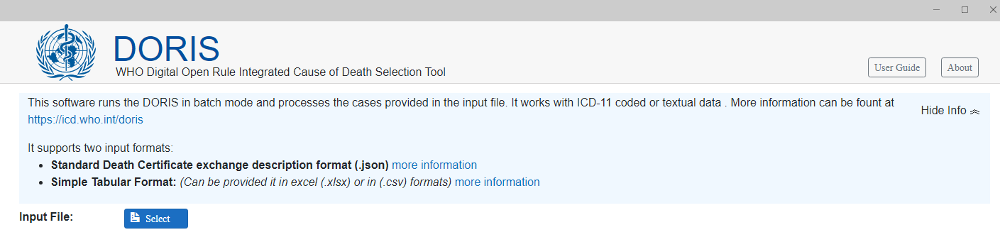
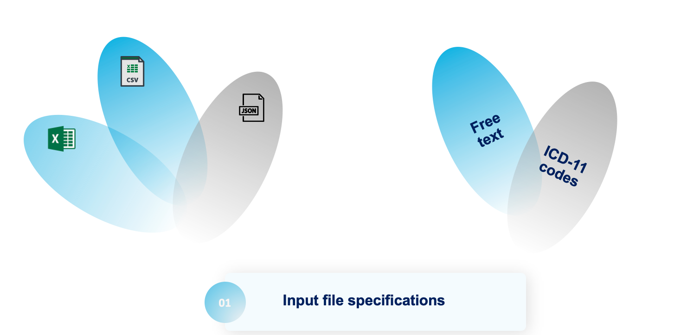
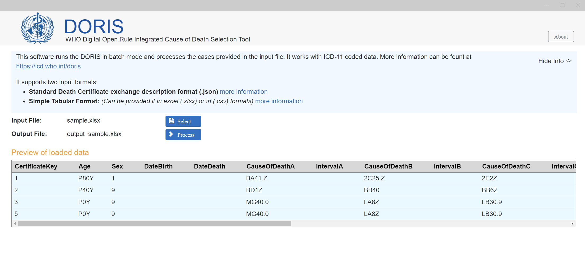

# DORIS Desktop Version for batch processing 

DORIS Desktop Version is a desktop software that can be installed on local computers. It is designed to allow effortless batch processing of large volumes of death certificates. Whether working with text or code modes, this software analyzes thousands of death certificates and supports multiple formats, Excel, CSV, and JSON.

## Download and quick installation

The DORIS UI desktop software for batch processing can be downloaded from the following link:

- Verison 1.0 Release Candidate 1 
	- Download link : [For Windows computers](https://icdcdn.who.int/doris/DorisUI_1.0.0-rc.1_windows_x64.msix)
   	- Download link for Mac computers is upcoming

DORIS installation and launch is a quick and very simple process and involves double-clicking on the downloaded file and following the on-screen instructions. 

## Loading the file and processing

1. Start by selecting the specific death certificate format (CSV or JSON) that you require. Click on the needed format and proceed to download it onto the local computer.

2. Once the download is complete, open the downloaded file. It is important to fill in the information accurately, ensuring not to modify the format or change the order of the columns. Maintain the original structure of the file.

3. Launch the DORIS tool on local desktop. Look for the **select key** to load a file for processing and select the file that was filled in with the cause of death information.

4. After selecting the file, click on the **process key** to initiate the file processing procedure. Once the tool completes the task, the output file will be automatically saved in the same location as the input file. and the processing time will be shown on the screen along with a sneak peak of the output file and the color coded columns 

By following these steps, users can effectively utilize the DORIS User Interface Desktop Version to run and process death certificate files, ensuring that the cause of death information is accurately captured and maintained.

## Supported modes and file formats

In order to use the DORIS tool effectively, users are required to provide an input file that includes the death certificates they want to process and analyze. The tool will examine the available information and following the ICD mortality rulebase which operates in the background and will automatically determine the underlying cause of death. 

By ensuring that the input file adheres to the required format, the tool can accurately analyze and process the information from the death certificates, providing users with an automatic selection of the underlying cause of death.

### Supported input files are text and code mode.

The DORIS tool can handle two distinct input modes: text and ICD-11 code. 

This versatility allows users to choose between entering the cause of death information in a text format or utilizing ICD-11 pre-coded data sets for efficient processing. By accommodating both input modes, the tool caters to different user preferences and data availability in countries.

     

### Supported file formats are Excel, CSV, and JSON.

By supporting multiple file formats Excel, CSV, and JSON, DORIS tool ensures compatibility and ease of use for users working with different data sources. 

**Excel files** are widely used for data management and analysis, while **CSV** (Comma-Separated Values) and **JSON** (JavaScript Object Notation) formats offer flexibility in exchanging and storing structured data. DORIS's compatibility with these formats enables users to import and analyze death certificates without the need for extensive data conversion or manipulation.

Users should prepare their data sets following the below templates. These template are specifically designed to ensure compatibility and proper data input in the DORIS tool. By clicking on the needed file format below, users can easily download the template and utilize it as a guideline for preparing their input file, ensuring that it meets the required format and structure. 

    

### Excel format    
For a sample in Excel format click here: [Excel Format Specification](en/docs/sample.xlsx)

### CSV format 
For a sample in Excel format click here: [CSV Format Specification](en/docs/sample.csv)

### JSON format
- The JSON format is based on the standard [Death Certificate Exchange Format](json-format.md) 

## Attributes for Input file

When entering input data, there are specific attributes related to the input fields that should be considered:

- CertificateKey: This attribute serves as a unique identifier for the certificate. Users need to define a CertificateKey to identify a particular certificate.

- International Classification of Diseases (ICD) version: Users must specify the version of the ICD that was used to code the certificate. The current supported version is ICD-11.

- Sex: This attribute represents the gender of the individual. The value "1" indicates Male, "2" indicates Female, and "9" indicates Unknown.

- Date of birth and date of death: Users should adhere to the specified date format when entering the dates of birth and death.

- Estimated age: When providing an estimated age for an individual, this attribute should be represented in the specified duration format. If only numbers are filled in the column, the tool will assume that the age is provided in years. 

- Cause of Death: This attribute can be completed in Part 1 and Part 2 using any of the following methods:

**Textual description**: Users have the option to provide a plain text description of the cause of death. In this case, they should fill in the corresponding columns in the input file, such as CauseOfDeathTextA, CauseOfDeathTextB, CauseOfDeathTextPart2, and so on.

**ICD-11 codes**: Users can enter ICD-11 codes separated by commas. They should fill in the corresponding columns in the input file, such as CauseOfDeathA, CauseOfDeathB, CauseOfDeathPart2, and so forth. Post-coordination is allowed, meaning that different codes can be combined, for example, "Stem code A & Ext code / Stem code B".

**URIs**: For ICD-11, users have the option to provide URIs (Uniform Resource Identifiers) for cause fields, separated by commas. They should fill in the corresponding columns in the input file, such as CauseOfDeathURIA, CauseOfDeathURIB, CauseOfDeathURIPart2, and so on. Post-coordination is allowed.

- Interval: Users can specify the time interval from the onset of the condition leading to death to the actual time of death. The interval should be represented in the specified duration format.

More information can be found [here](https://github.com/ICD-API/electronic-death-certificate-format-tabular)

### Checking the output file

TBA

