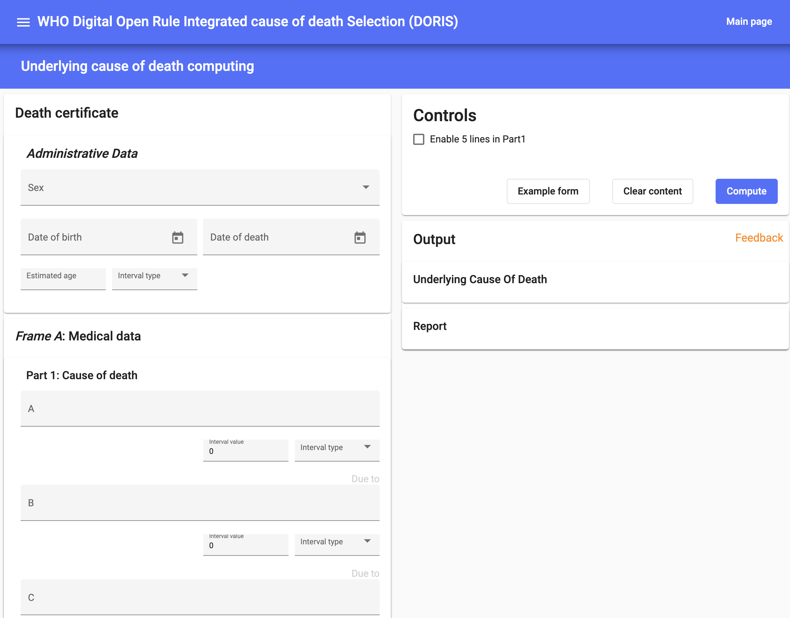

# DORIS Web Version

DORIS Web Version is a web-based application accessible through a web browser. It applies the ICD mortality rules on individual death certificates for cause of death selection. The web version can be accessed at: https://icd.who.int/doris/tool

Provide the required information about the deceased individual.

**Administrative Data**: Fill in the following details - Gender, Date of Birth, Date of Death, and Estimated Age (in years, months, weeks, days, hours, minutes, or seconds), or leave it unknown.

In Frame A, the **Medical Data** fields consist of the following sections:

Part 1: Specify the Cause(s) of Death by completing Line a, b, c, and d, along with their respective time intervals.

Part 2: Indicate any other significant conditions contributing to the death, along with their corresponding time intervals. In this section, you can assign time intervals separately for each reported condition. To do so, click on the assigned code for each condition and then input the relevant time interval.

