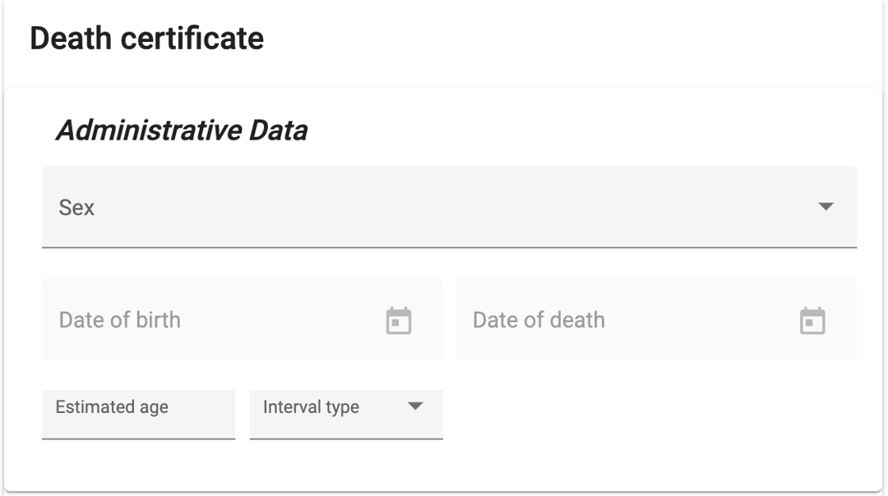
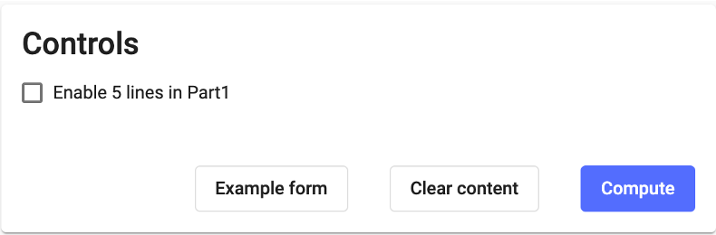

# DORIS Web Version

DORIS Web Version is a web-based application accessible through a web browser. It applies the ICD mortality rules on individual death certificates for cause of death selection. The web version can be accessed at: https://icd.who.int/doris/tool

Provide the required information about the deceased individual.

**Administrative Data**: Fill in the following details - Sex, Date of Birth, Date of Death, and Estimated Age (in years, months, weeks, days, hours, minutes, or seconds), or leave it unknown.

In Frame A, the **Medical Data** fields are associated with the ICD-11 coding tool, allowing users to search by term or by ICD-11 code.

Part 1: Cause(s) of Death - Complete Line a, b, c, and d along with their respective time intervals. 

Part 2:  Indicate any other significant conditions contributing to the death, along with their corresponding time intervals. In this section, time intervals can be assigned separately for each reported condition. To do so, users need to search for the condition by term or ICD-11 code using the coding tool then assign the relevant time interval after selecting the condition.

Frame B consists of the following fields:

**Details of Surgery**: Provide any relevant information about surgeries performed on the deceased by answering the questions.

**Manner of Death**: Specify the manner in which the death occurred (e.g., natural, accident, suicide, homicide).

**Place of occurrence** of the external cause: specify the place where the external cause (e.g., accident, injury) occurred. This information is essential for accurately documenting the circumstances surrounding the death.

**Fetal or Infant Death**: Fill in the needed information on multiple pregnancy, stillbirth specifying the number of hours survived if applicable, the birth weight, the number of completed weeks of pregnancy, the age of the mother and if the death was perinatal, the conditions of the mother that affected the fetous should be specified. 

For women: 

**Pregnancy Status**: Was the deceased pregnant at the time of death? Choose the appropriate option. 

**Time from Pregnancy**: If the deceased individual was pregnant, provide the time from pregnancy.

**Contribution of Pregnancy to Death**: Determine if the pregnancy played a role in the woman's death. 

To demonstrate the functionality of the DORIS web version, an **examples form** key provides a few examples to showcase how the web version operates. Users can refer to these examples to understand how to use the web version effectively.

Additionally, the **clear content** key was introduced. By clicking on this key, users can initiate a fresh death certificate with all the fields cleared, allowing them to start with a new entry without any existing data.

To compute the required Underlying Cause of Death (UCOD), users should simply click on the '**Compute**' button. This action will generate the necessary information based on the entered data, helping users select the underlying cause of death.

**Output section** 

Once the Underlying Cause of Death (UCOD)is selected, it will be presented in the **output** section which includes two distinct fields related to the **underlying cause of death.** The first field represents the single underlying cause of death that was selected based on the information provided and is highlighted in yellow to draw the attention of the users. Additionally, if available, the output section also includes a field for the **cluster underlying cause of death**. This field indicates the postcoordinated codes if applicable providing further context and details. 

Furthermore, within the output section, a report is provided to illustrate the steps and mortality rules that were applied in the selection of the underlying cause of death. 
The report includes a **warnings** field, which flags any inconsistencies in the reported information or suggests the need for manual verification. 

Following the warnings, a concise report outlines the main steps that were applied. For a more detailed understanding, a full report is also included in the output section. This comprehensive report provides a thorough explanation of the sequence followed, along with detailed information about the mortality rules and steps that were applied or not during the selection of the underlying cause of death.

