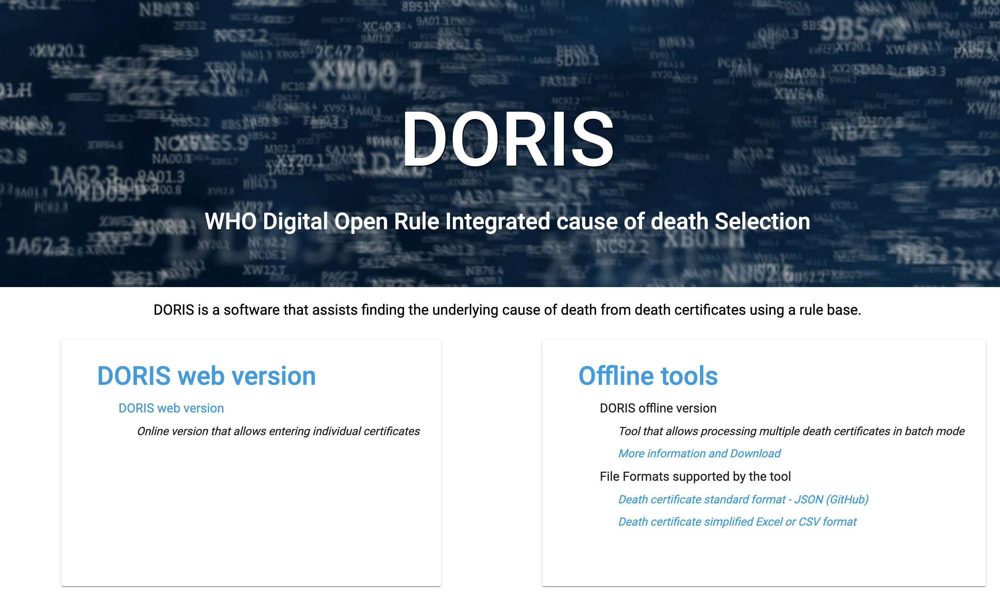

# DORIS - WHO Digital Open Rule Integrated cause of death Selection 

**DORIS** is a software developped to facilitate the identification of the underlying cause of death. This tool examines the information provided on the certificates and assists in automatically selecting the underlying cause of death following the mortality rule-base of the International Classification of Diseases (ICD). This means that the underlying logic and decision-making process of the tool are aligned with the internationally recognized standards and guidelines provided by the ICD-11 reference guide for selecting the underlying causes of death. By adhering to the ICD mortality rule-base, the tool ensures compatibility and consistency with the global framework for cause of death classification. This enables accurate and standardized reporting of causes of death, promoting reliable and comparable mortality data analysis. 

**DORIS** offers multiple options for its usage, providing flexibility and convenience to users. It can be used as a web application or as a standalone application with a user interface that can be installed on any computer.

  - **DORIS Web Version** is a web-based application accessible through a web browser. It applies the ICD mortality rules on individual death certificates for cause of death selection. The web version can be accessed at: [https://icd.who.int/doris/tool](https://icd.who.int/doris/tool)
  > More information on the web version is available here: [here](doris-web.md)

  - **DORIS UI (Desktop Version for batch processing)** is a desktop software that can be installed on local computers. It is designed to allow effortless batch processing of large volumes of death certificates. Whether working with text or code modes, this software analyzes thousands of death certificates and supports multiple formats, Excel, CSV, and JSON.
 > To learn more about the desktop version, refer to [here](doris-ui.md)
  
  - Additionally, you can access DORIS through an **DORIS API (Application Programming Interface)**. Although currently in a pre-release version, this feature enables integration with other systems or applications.
> Information regarding the API can be found at [ICD-API](https://icd.who.int/icdapi) with further details available [here](doris-api.md)

  
