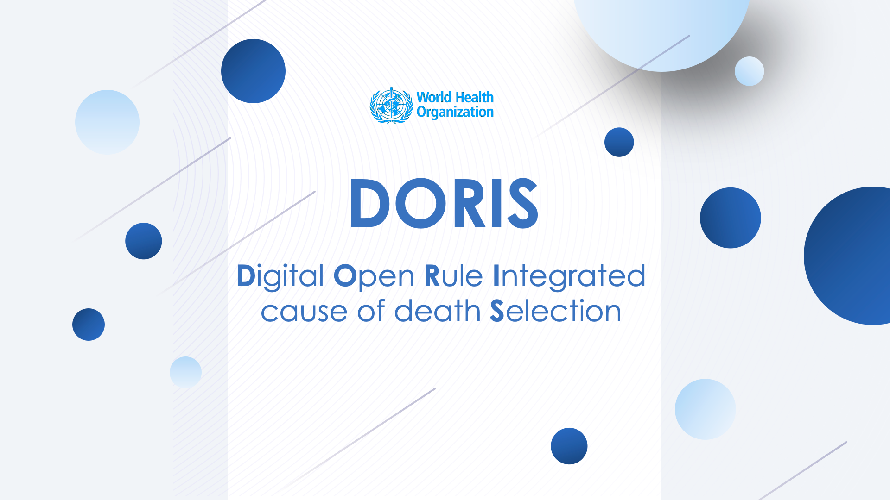

# Digital Open Rule Integrated cause of death Selection tool

**DORIS** is a software developed to facilitate the identification of the underlying cause of death. This tool examines the information provided on the death certificates and assists in automatically selecting the underlying cause of death following the mortality rules of the International Classification of Diseases (ICD) that have been fully digitalized. 

**DORIS** analysis capabilities play a crucial role in extracting valuable insights from the vast amount of data contained in death certificates. It employs an advanced algorithm to process and interpret the information, enabling users to uncover patterns, trends, and underlying causes of death. This analysis is invaluable for public health surveillance, epidemiological studies, and policy decision-making, as it facilitates the identification of key health indicators, disease prevalence, and potential areas for intervention.

**DORIS** ability to handle thousands of death certificates in text and code mode and support multiple file formats offers immense benefits to users. It streamlines data analysis processes, promotes interoperability with various data sources, and empowers users to gain meaningful insights from extensive datasets, ultimately contributing to improved public health outcomes and informed decision-making.

**DORIS** offers multiple options for its usage, providing flexibility and convenience to users. It can be used as a web application or as a standalone application with a user interface that can be installed on any computer.

  - **DORIS Web Version** is a web-based application accessible through a web browser. It applies the ICD mortality rules on individual death certificates for cause of death selection. The web version can be accessed at: [https://icd.who.int/doris/tool](https://icd.who.int/doris/tool)
  > More information on the web version is available: [here](doris-web.md)

  - **DORIS UI (Desktop Version for batch processing)** is a desktop software that can be installed on local computers. It is designed to allow effortless batch processing of large volumes of death certificates. Whether working with text or code modes, this software analyzes thousands of death certificates and supports multiple formats, Excel, CSV, and JSON.
 > To learn more about the desktop version, refer to [here](doris-ui.md)
  
  - Additionally, you can access DORIS through an **DORIS API (Application Programming Interface)**. Although currently in a pre-release version, this feature enables integration with other systems or applications.
> Information regarding the API can be found at [ICD-API](https://icd.who.int/icdapi) with further details available [here](doris-api.md)

  
